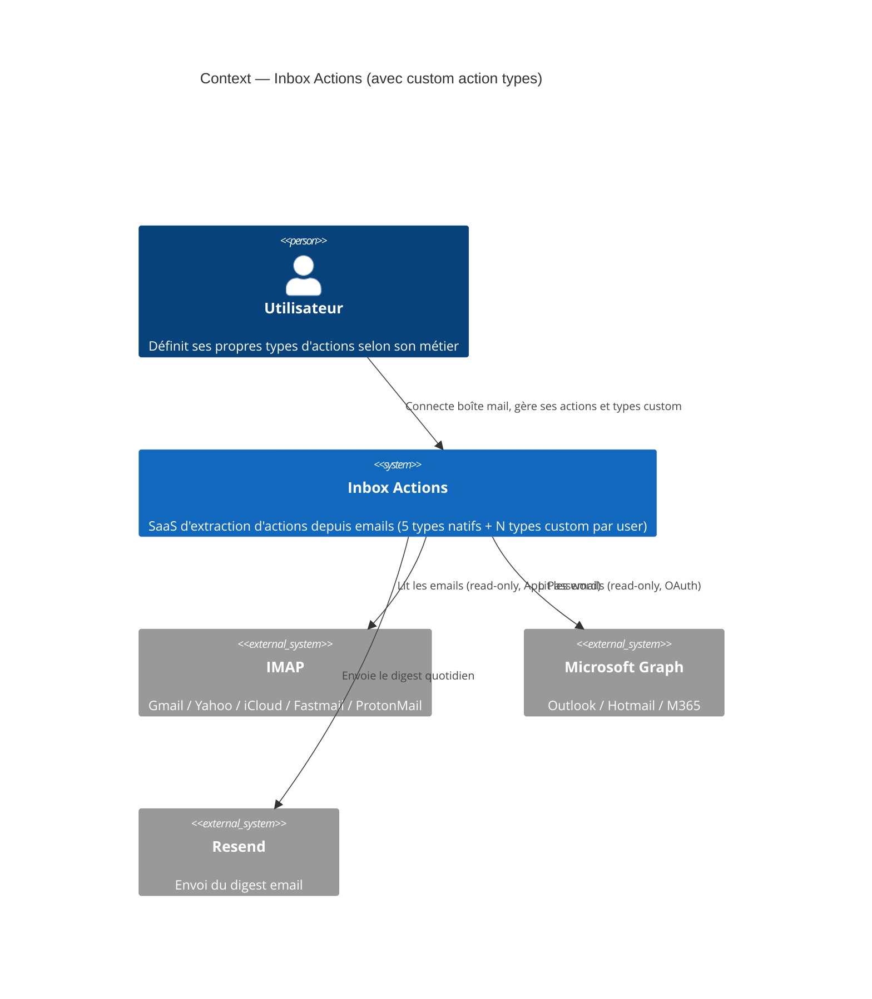
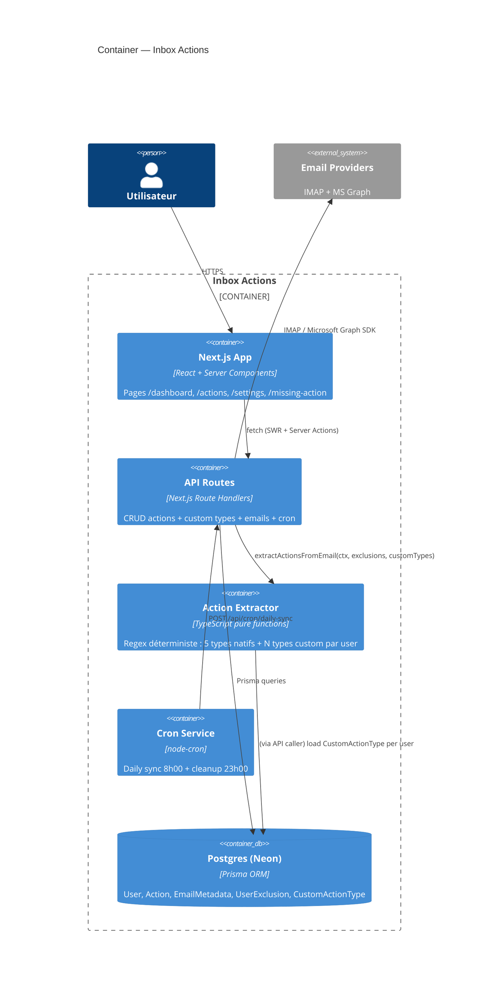

# C4 Diagrams — Custom Action Types

Phase 2 architecture — feature "Actions personnalisées utilisateur".
Les diagrammes ci-dessous étendent le système existant. Tester le rendu sur https://mermaid.live.

---

## 1. Context Diagram

Pas de changement structurel : aucun nouvel acteur externe. La feature est entièrement interne.



---

## 2. Container Diagram

Ajout : la table `CustomActionType` est consommée par le pipeline d'extraction à chaque scan.



---

## 3. Component Diagram — Pipeline d'extraction

Zoom sur le composant **Action Extractor**, où la modification est concentrée.

```mermaid
C4Component
  title Component — Action Extractor (lib/actions/)
  Container(api, "API / Cron caller", "daily-sync-job, /api/email/analyze")
  ContainerDb(db, "Postgres")

  Component_Boundary(extractor, "extract-actions-regex.ts") {
    Component(orchestrator, "extractActionsFromEmail()", "TypeScript", "Orchestre extraction native + custom + dedup")
    Component(native, "extractNativeActions()", "TypeScript", "5 patterns figés : SEND / CALL / FOLLOW_UP / PAY / VALIDATE")
    Component(custom, "extractCustomActionsFromEmail()", "TypeScript", "NEW — Compile keywords user en regex à la volée + applique gating anti-ambiguïté")
    Component(gating, "isConcreteEnough() + helpers anti-ambiguïté", "TypeScript", "Conditionnels faibles, marqueurs forts, deadline → réutilisé par natif ET custom")
    Component(dedup, "deduplicateActions()", "TypeScript", "Évite double-extraction si pattern natif + custom matchent")
  }

  Rel(api, orchestrator, "Appelle avec context, exclusions, customTypes[]")
  Rel(orchestrator, native, "Étape 1")
  Rel(orchestrator, custom, "Étape 2 si customTypes.length > 0")
  Rel(native, gating, "Filtre")
  Rel(custom, gating, "Filtre (réutilise les mêmes helpers)")
  Rel(orchestrator, dedup, "Merge des résultats")
  Rel(api, db, "SELECT CustomActionType WHERE userId=? AND isActive=true")
```

**Points clés du diagramme** :
- `extractCustomActionsFromEmail()` est un nouveau composant, mais **réutilise** les helpers de gating anti-ambiguïté (cohérence garantie).
- Les `customTypes` sont chargés par l'**API caller** (pas par l'extracteur lui-même → fonction pure, testable).
- Le dedup final évite les doublons quand un pattern custom correspond aussi à un natif.
