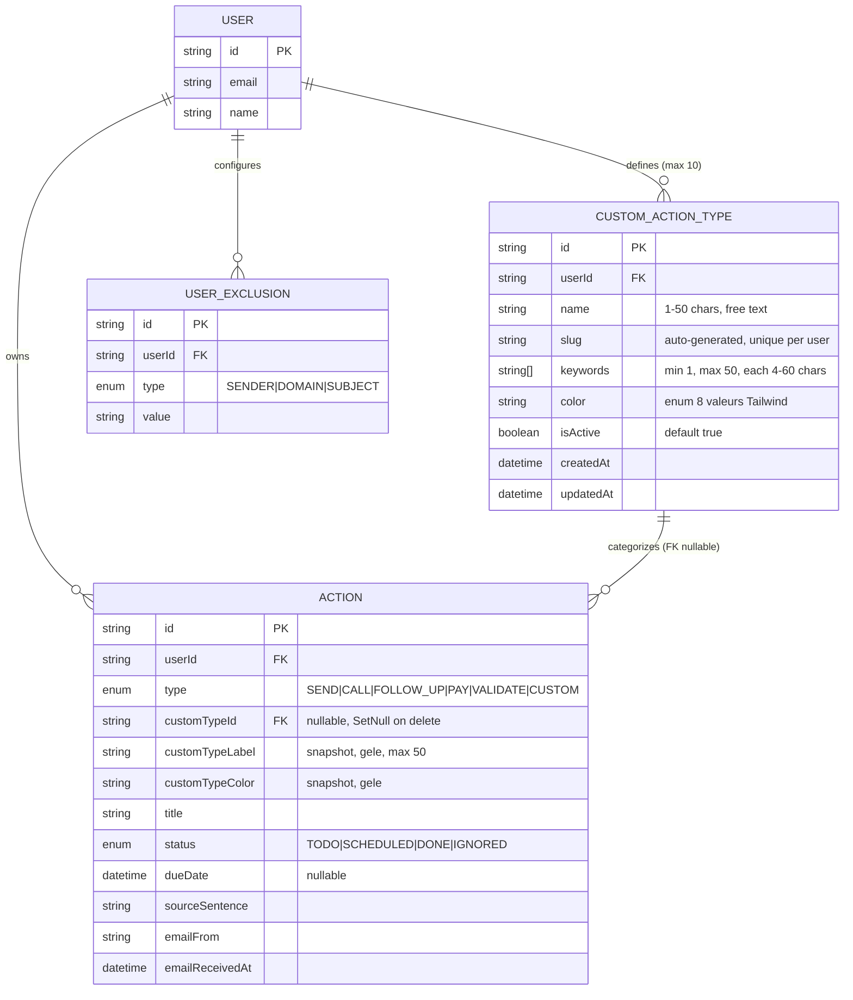

# Data Model — Custom Action Types

## ERD



## Schéma Prisma — extrait à appliquer

À ajouter dans `prisma/schema.prisma` :

```prisma
model CustomActionType {
  id        String   @id @default(cuid())
  userId    String
  name      String   @db.VarChar(50)
  slug      String
  keywords  String[]
  color     String   // valeurs admises : slate | blue | indigo | violet | pink | rose | orange | amber
  isActive  Boolean  @default(true)
  createdAt DateTime @default(now())
  updatedAt DateTime @updatedAt

  user    User     @relation(fields: [userId], references: [id], onDelete: Cascade)
  actions Action[] @relation("CustomTypeActions")

  @@unique([userId, slug])
  @@index([userId, isActive])
}

enum ActionType {
  SEND
  CALL
  FOLLOW_UP
  PAY
  VALIDATE
  CUSTOM      // NEW
}

model Action {
  // ... champs existants ...
  type             ActionType
  customTypeId     String?
  customTypeLabel  String?           @db.VarChar(50)
  customTypeColor  String?
  customType       CustomActionType? @relation("CustomTypeActions", fields: [customTypeId], references: [id], onDelete: SetNull)
  // ... reste existant ...

  @@index([userId, status, type, customTypeId])
}

model User {
  // ... existant ...
  customActionTypes CustomActionType[]
}
```

## Migration

Une seule migration Prisma, ordre :

1. `ALTER TYPE "ActionType" ADD VALUE 'CUSTOM'` (Postgres natif, **non-transactionnel**)
2. `CREATE TABLE "CustomActionType" (...)`
3. `ALTER TABLE "Action" ADD COLUMN "customTypeId" / "customTypeLabel" / "customTypeColor"` + FK + index

**Déploiement** : `prisma migrate deploy` doit s'exécuter avant le `next build` qui consomme la nouvelle valeur d'enum (déjà géré par CI/CD existant).

## Contraintes & invariants

| Invariant | Garantie |
|---|---|
| `Action.customTypeId IS NOT NULL ⇒ Action.type = 'CUSTOM'` | Vérifié au runtime côté API, pas de check SQL CHECK (Postgres limité ici) |
| `Action.type = 'CUSTOM' ⇒ Action.customTypeLabel IS NOT NULL` | Vérifié au runtime — toujours snapshotté à la création |
| `count(CustomActionType.userId = X) ≤ 10` | Vérifié dans `POST /api/custom-action-types` (renvoie 400 si déjà 10) |
| `(userId, slug) unique` | SQL `@@unique` |
| `Action.customTypeId` reste valide tant que `CustomActionType` vit | FK + `onDelete: SetNull` |
| `Action.customTypeLabel/Color` ne change jamais après création | Aucun PATCH ne les touche (ils ne sont pas dans le body de update Action) |

## Palette de couleurs admises

8 valeurs string, mappées côté UI vers des classes Tailwind via `lib/custom-action-colors.ts` :

| Slug couleur | Tailwind bg | Tailwind text | Cas d'usage suggéré |
|---|---|---|---|
| `slate` | `bg-slate-100 dark:bg-slate-900/40` | `text-slate-800 dark:text-slate-300` | Neutre / défaut |
| `blue` | `bg-blue-100 dark:bg-blue-900/40` | `text-blue-800 dark:text-blue-300` | Communication |
| `indigo` | `bg-indigo-100 dark:bg-indigo-900/40` | `text-indigo-800 dark:text-indigo-300` | Brand / engagement |
| `violet` | `bg-violet-100 dark:bg-violet-900/40` | `text-violet-800 dark:text-violet-300` | Brand alt |
| `pink` | `bg-pink-100 dark:bg-pink-900/40` | `text-pink-800 dark:text-pink-300` | Personnel / RH |
| `rose` | `bg-rose-100 dark:bg-rose-900/40` | `text-rose-800 dark:text-rose-300` | Urgence soft |
| `orange` | `bg-orange-100 dark:bg-orange-900/40` | `text-orange-800 dark:text-orange-300` | Suivi / relance |
| `amber` | `bg-amber-100 dark:bg-amber-900/40` | `text-amber-800 dark:text-amber-300` | Validation / arbitrage |

Rotation par défaut : `palette[index % 8]` où `index` = nombre de types existants au moment de la création.
