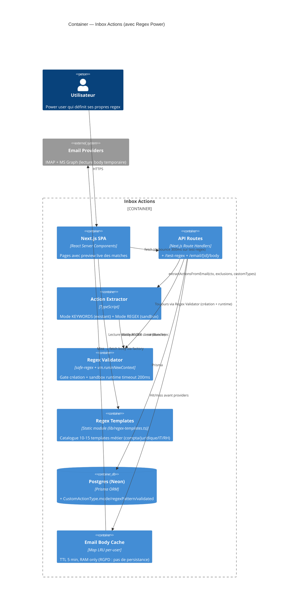

# C4 Diagrams — Regex Power

Diagrammes en extension du C4 [custom-actions](../c4-diagrams.md). Tester rendu sur https://mermaid.live.

---

## 1. Context Diagram

**Inchangé** vs custom-actions. Aucun nouvel acteur externe — la feature reste 100% interne.

---

## 2. Container Diagram (extension)

Ajout de 3 surfaces : `Regex Validator`, endpoint `Email Body`, fichier statique `Regex Templates`.



---

## 3. Component Diagram — Pipeline d'extraction étendu

Zoom sur l'extracteur. La modification se concentre sur `extractCustomActionsFromEmail` qui devient un **strategy pattern** (KEYWORDS vs REGEX).

```mermaid
C4Component
  title Component — Action Extractor étendu (regex-power)
  Container(api, "API / Cron caller", "daily-sync, /api/email/analyze")
  ContainerDb(db, "Postgres")

  Component_Boundary(extractor, "lib/actions/") {
    Component(orchestrator, "extractActionsFromEmail()", "TypeScript", "Orchestre native + custom + dedup")
    Component(native, "extractNativeActions()", "TypeScript", "5 patterns figés (inchangé)")
    Component(custom, "extractCustomActionsFromEmail()", "TypeScript", "Strategy switch sur mode")
    Component(kw, "compileKeywordsRegex()", "TypeScript", "Mode KEYWORDS (existant — bg word boundary Unicode FR)")
    Component(rx, "compileSafeUserRegex()", "TypeScript", "NEW — Mode REGEX, exécute via Sandbox")
    Component(sandbox, "RegexExecutor (sandbox)", "vm.runInNewContext + timeout 200ms", "Couche runtime ADR-005")
    Component(gating, "Anti-ambiguity helpers", "TypeScript", "isConcreteEnough, conditionnels, marqueurs forts (partagés)")
    Component(dedup, "deduplicateActions()", "TypeScript", "Évite doublons natif/custom")
  }

  Rel(api, orchestrator, "(ctx, exclusions, customTypes[])")
  Rel(orchestrator, native, "Étape 1")
  Rel(orchestrator, custom, "Étape 2 si customTypes.length > 0")
  Rel(custom, kw, "Si mode === KEYWORDS")
  Rel(custom, rx, "Si mode === REGEX")
  Rel(rx, sandbox, "vm safe execution")
  Rel(sandbox, sandbox, "Timeout 200ms → throw → catch → skip email")
  Rel(custom, gating, "Filtre anti-ambiguïté (partagé natif)")
  Rel(orchestrator, dedup, "Merge final")
  Rel(api, db, "SELECT customActionType WHERE userId AND isActive AND validated=true")
```

**Points clés** :
- `compileSafeUserRegex` est nouveau ; passe par le `RegexExecutor` (vm sandbox + timeout)
- Le gate `validated: true` est appliqué côté query DB → un pattern non validé n'arrive jamais à l'extracteur (défense en profondeur)
- L'API caller filtre `validated: true` quand il charge les types pour le scan
