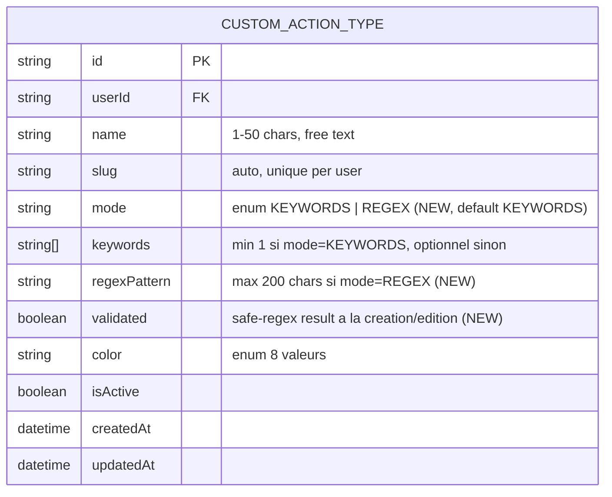

# Data Model — Regex Power

Extension du modèle [custom-actions](../data-model.md) avec 3 colonnes sur `CustomActionType`. Aucune nouvelle table.

## ERD (delta)



## Schema Prisma — extrait à appliquer

À ajouter dans `prisma/schema.prisma` :

```prisma
enum CustomActionTypeMode {
  KEYWORDS
  REGEX
}

model CustomActionType {
  id           String   @id @default(cuid())
  userId       String
  name         String   @db.VarChar(50)
  slug         String
  mode         CustomActionTypeMode @default(KEYWORDS)  // NEW
  keywords     String[]                                  // reste obligatoire si mode=KEYWORDS
  regexPattern String?  @db.VarChar(200)                 // NEW
  validated    Boolean  @default(false)                  // NEW
  color        String
  isActive     Boolean  @default(true)
  createdAt    DateTime @default(now())
  updatedAt    DateTime @updatedAt

  user    User     @relation(fields: [userId], references: [id], onDelete: Cascade)
  actions Action[] @relation("CustomTypeActions")

  @@unique([userId, slug])
  @@index([userId, isActive, validated])  // NEW : extracteur ne charge que validated=true
}
```

## Migration

Une seule migration : 3 colonnes ajoutées + index étendu.

```sql
-- Migration : extend CustomActionType for regex-power
CREATE TYPE "CustomActionTypeMode" AS ENUM ('KEYWORDS', 'REGEX');

ALTER TABLE "custom_action_types"
  ADD COLUMN "mode" "CustomActionTypeMode" NOT NULL DEFAULT 'KEYWORDS',
  ADD COLUMN "regex_pattern" VARCHAR(200),
  ADD COLUMN "validated" BOOLEAN NOT NULL DEFAULT false;

-- Les types existants en mode KEYWORDS sont automatiquement marqués validated=true
-- (ils sont passés par l'ancienne validation)
UPDATE "custom_action_types" SET "validated" = true WHERE "mode" = 'KEYWORDS';

-- Nouvel index pour la query extracteur (filter on validated)
DROP INDEX IF EXISTS "custom_action_types_userId_isActive_idx";
CREATE INDEX "custom_action_types_userId_isActive_validated_idx"
  ON "custom_action_types"("userId", "isActive", "validated");
```

**Déploiement** : `prisma migrate deploy` avant `next build`. La migration est rétro-compatible (defaults garantissent qu'aucun code existant ne casse).

## Invariants runtime (vérifiés API + tests)

| Invariant | Garantie |
|---|---|
| `mode === "KEYWORDS"` ⇒ `keywords.length ≥ 1` ET `regexPattern === null` | Validation Zod côté API + check explicite |
| `mode === "REGEX"` ⇒ `regexPattern !== null` ET `regexPattern.length ≤ 200` | Validation Zod côté API |
| `validated === false` ⇒ extracteur skip ce type | Query Prisma `where: { validated: true }` côté caller |
| `safe-regex(regexPattern) === true` ⇒ `validated = true` | Logique POST/PATCH côté API |
| Si `regexPattern` change → re-validation safe-regex avant `validated = true` | PATCH /api/custom-action-types/[id] |

## Compat avec les Actions existantes

- Action garde `customTypeId / Label / Color` snapshots (inchangé — voir ADR-001 custom-actions)
- Pas besoin de stocker `mode` ni `regexPattern` sur Action — c'est une info **type-level**, pas instance-level
- Si un type custom passe de KEYWORDS à REGEX et inverse : les Actions historiques restent inchangées, leur badge utilise les snapshots (label + color)
